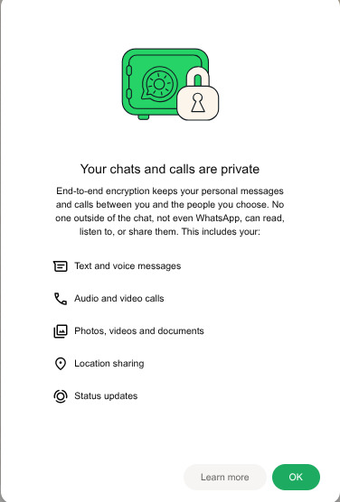

# Tweakio — WhatsApp Web Automation Bot

[](https://github.com/yourusername/yourrepo)
[](LICENSE)
[](https://github.com/yourusername/yourrepo/issues)

> **Tweakio** — a human-like WhatsApp Web automation agent that centralizes actions, simulates real-user behavior, and allows easy AI-driven message processing and integrations.

---

## Table of Contents

* [Why Tweakio?](#why-tweakio)
* [Key Features](#key-features)
* [High-level Flow](#high-level-flow)
* [Requirements](#requirements)
* [Quick Start](#quick-start)
* [.env (configuration)](#env-configuration)
* [Commands / Menu](#commands--menu)
* [Architecture & Modules](#architecture--modules)
* [Contributing](#contributing)
* [Testing & CI](#testing--ci)
* [Security & Privacy](#security--privacy)
* [Roadmap](#roadmap)
* [Support & Contact](#support--contact)
* [License](#license)
* [Final Demo](#final-demo)

---

## Why Tweakio?

Tweakio is built to automate WhatsApp Web **without** relying on the Business API or unsafe reverse-engineered scripts. It focuses on:

* Human-like browser simulation (stealth, mouse movements, delays) to reduce detection risk.
* Easy integration with AI backends (Gemini, GROQ, OpenRouter, etc.) for natural responses and command routing.
* Acting as a hub to signal other connected automation agents (manual integration required).
* A modular, extensible architecture so companies or hobbyists can build custom automations on top.

---

## Key Features

* Natural language + command-based routing using quantifiers (e.g. `//`) and trigger prefixes.
* Robust media handling: send & detect images (preview), docs, audio, video, GIFs, stickers, quoted messages.
* Admin controls: pause/unpause, ban/unban chats, admin list management.
* Modes: per-chat, global mode, and configurable `MAX_CHAT` concurrency.
* Partial AI selectors (Playwright modern selectors + regex) for resilience against UI changes.
* Planned: async uploads/downloads, profile automation (DP/profile), YouTube/Google live search integration.

---

## High-level Flow

```
Incoming message -> Bot scans chats -> if NEW -> open chat -> check for prefix (e.g. //) ->
parse quantifier & command -> forward remaining text to configured LLM -> send response
```

**Command format:**

```
<Quant> <f_name> <f_info (optional)>
```

Example:

```
 // ai Hi whastapp ? Any new Joke ?
```

---

## Requirements

* Python 3.12+
* Playwright + playwright-stealth
* LangChain ( For Advanced AI Routing)
* Camoufox Browser + BrowserForge Integration

Setup:

```bash
# ----- For Linux / Mac based -----
python -m venv .venv
source .venv/bin/activate
pip install -r requirements.txt
playwright install
```

Direct install:

```bash
pip install playwright playwright-stealth
playwright install
pip install requests python-dotenv pyperclip
pip install -U langchain langsmith
```

---

## Quick Start

1. Clone the repo:

```bash
git clone https://github.com/yourusername/yourrepo.git
cd yourrepo
```

2. Copy and edit environment file:

```bash
cp Example.env.example .env
# edit values in .env 
```

3. Install dependencies:

```bash
pip install -r requirements.txt
playwright install
```

4. Start the bot:

```bash
python3 gui.py
# --- GUI has been added for easy accessibility ---- 
```

---

## .env (configuration)

Example:

```env
PYTHONUNBUFFERED=1;
PROFILE=Tweakio; 
BOT_NUMBER=76xxxxxxxxxx;
BOT_NUM_COUNTRY=India; #YOUR Region
ADMIN_NUMBER=76xxxxxxxx;
GEM_API_KEY=YOUR API;
LANGCHAIN_API_KEY='Your API'
GET_URL=https://api.agent.ai/v1/agent/<Your Agent>/webhook/<Your link>/status/<run_id>;
LOGIN_METHOD=1;  #1 for scan , 2 for Code based -- Good for CLI Deployment
YOUTUBE_API_KEY=Your API

# we have more ENV Settings , but for now these are good enough
# For Explore u can checkout in the Exmaple.env.example 

# Get ur GET/POST URL from -> https://agent.ai/
```

---

## Commands / Menu

* `menu` — show main menu (Under Construction)
* `help` — display help commands 
* `manual` — show manual instructions (Under construction)
* `setgc` — toggle group chat mode
* `showgc` — show group chat status
* `setchat` — configure current chat settings
* `showchat` — display no of Top chats it is checking to work
* `add <user>` / `remove <user>` — manage admins (Good for when ur account is Global off but admins are still allowed to use ur bot)
* `showlist` — show admin list
* `banlist` — show banned users
* `setq` — set quantifier
* `showq` — display quantifier
* `detect` — detect incoming media type ( Current : Txt , Image , Video) ( future -> Sticker , voice)
* `inject` — send as document/payload
* `send` — send Media with loaded content (Video is Under Construction)
* `savevid` — save video media (Experimental , May give error/Fail)
* `fill` — Fills any google form with info from pre-logs & Info.txt (In Google FormFiller Folder ) (Under Construction -> Need Google sign in fix)
* `ai` — generate AI response ( Future Usage: Business Vault for fast business based act / Personal Vault for auto replying on user's behalf)
* `audio` — Sends Audio File (Add the audio file + change path in commands)
* `yt.search <query>` — search YouTube query ( Uses YOUTUBE API)
* `yt.audio <url>` — download YouTube audio (Downloads the mp3 from yt url (Under Construction))
* `yt.dlp.s` — advanced YouTube search (Uses YT-DLP package) (May Error/Fail)

---

## Architecture & Modules

```
gui.py ( Starting point ) 
/Whatsapp
    ├─ BrowserManager/
        ├─
    ├─ utils/
    ├─ tests/
Example.env.example
requirements.txt
README.md
```

---

## Contributing

Checklist:

1. Fork the repo
2. Create a feature branch
3. Install dependencies
4. Test before pushing
5. Open PR with description

Labels: `good first issue`, `help wanted`, `bug`, `enhancement`, `docs`

---

[//]: # ()
[//]: # (## Testing & CI)

[//]: # ()
[//]: # (Use `pytest` for tests.)

[//]: # (Example CI pipeline:)

[//]: # ()
[//]: # (* Checkout)

[//]: # (* Setup Python)

[//]: # (* Install deps)

[//]: # (* Install Playwright)

[//]: # (* Run tests)

[//]: # ()
[//]: # (---)

[//]: # (## Security & Privacy)

[//]: # ()
[//]: # (* Never commit `.env` or keys)

[//]: # (* Rate-limit sensitive actions)

[//]: # (* Rotate API keys regularly)

[//]: # ()
[//]: # (---)

## Roadmap
* Profile automation
* Google live search
* Instant Bussiness & Customer Service integration
* Personal Vault integration
* Auto-Reply integration
* Plugin system for agents

---

## Support & Contact

* GitHub issues
* Discussions

---

## License

MIT License

---

## Final Demo

**Mobile view:**  


**WhatsApp Web view:**  


**Video Demo:**  
Click on it to view.
[](https://drive.google.com/file/d/1pjlD6HDqRPpdDhgKtuEwiEpqBnmUWYtN/view?usp=sharing)

*Also at new login u can face this bitch , so  to remove this is to manually , else if errored then just restart it , TO fix this is like random, comes or not for this addition will only long the time or overhead.*


